#  Exemple documenté d’utilisation du programme

Ce document montre comment un utilisateur externe peut :

- Installer le programme
- Lancer le programme (`main.py`)
- Utiliser ses fonctionnalités principales

---


## 📦 Installation du programme
Pour utilise le programme il faut faire les étapes suivantes (par exemple sur PyCharm):

- cloner le projet GitHub à partir de l'url : https://github.com/LINA-SEGL/projet_equipe-6
    - OU faire : ```git clone https://github.com/LINA-SEGL/projet_sessionE2025.git```
- Définir un environnement virtuel .venv
- Dans la console éxécuter la commande suivante:
```
pip install -e .
```
- Installer Xfoil, si le fichier xfoil.exe n'est pas présent lors du clonage, il doit se trouver dans le même dossier que le main.py (Dans le dossier : projet_session_E2025)
- Il faut absolument définir le dossier src comme fichier source.
    - Pour cela dans Pycharm faites clic-droit / Mark Directory as / Sources Root (le fichier devrait être bleu).

Installez également si cela n'est pas fait automatiquement dans l'installation précédente:

```
pip install python-opensky
```

## Utilisation

Si l'installation s'est bien passée, ce qui devrait être le cas vous devriez pouvoir lancer le main à partir du fichier main.py.


##  Exemple d'utilisation avec `main.py`

Pour tester rapidement le programme après installation :
```
Run Main.py
```

##  Déroulement et fonctionnalités testées

L’utilisateur sera guidé par des menus interactifs.

### 🔹 Exemple de scénario dans le cas d'import  :

1. Importer un profil depuis **AirfoilTools** (ex: `naca2412`)
2. Afficher le **contour du profil**
3. Générer les **courbes aérodynamiques** (CL, CD, CM) via **AirfoilTools-XFoil**
4. Simuler un **vol réel** (OpenSky) ou **personnalisé**
5. Afficher les **courbes correspondantes**
6. Calculer la **finesse maximale**
7. Simuler un **givrage** (zone personnalisée, Mach, Reynolds)
8. Afficher la **comparaison des polaires normales/givrées**

---

##  Remarques

- Le programme fonctionne en **ligne de commande**, avec **affichage graphique** via `matplotlib`.
- L’utilisateur **n’a pas besoin de modifier le code** : tout est guidé pas à pas.

---

##  Résultat attendu

L'utilisateur est capable de :

-  Importer un profil  
-  Obtenir ses performances aérodynamiques  
-  Les visualiser et les comparer  
-  Tester des conditions réelles de vol ou bien personnelles 
-  Appliquer une simulation de givrage à fin de voir son influence sur les performmance 


##  Simulation étape par étape

###  Choix du mode d’obtention du profil
Dès que l’on lance le programme 

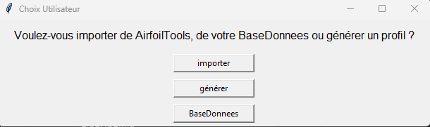

Une fenêtre s’ouvre pour demander **comment obtenir un profil NACA** :

- **Importer** → depuis le site [AirfoilTools](http://airfoiltools.com)  
- **Générer** → créer un profil NACA à partir des paramètres manuels  
- **BaseDonnees** → charger un profil déjà enregistré dans la base locale  

>  Comme il s'agit de la première utilisation, la base de données est encore vide.  
> Il faut donc **soit importer un profil, soit en générer un nouveau**.

###  Importer un profil NACA de Airfoil

Si l’on choisit **Importer**, une nouvelle fenêtre apparaît.  
L’utilisateur est invité à **entrer le nom du profil NACA à importer**.

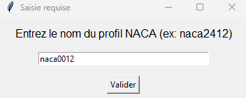

 Il suffit de saisir :
- soit les **4 chiffres** du profil NACA classique (`naca2412`, `naca0012`, etc.)
- soit **5 ou 6 chiffres** pour les profils plus complexes (`naca23012`, `naca633418`, etc.)

 Le profil doit exister sur le site [AirfoilTools](http://airfoiltools.com) pour que l’import fonctionne.

Dans notre exemple, nous saisissons :
```text
naca0012
```
### Confirmation de l’import et enregistrement du profil
une fois le profil importé, le programme affiche une **fenêtre d’information** confirmant que :

> Les coordonnées du profil ont été enregistrées dans le fichier : `0012_coord_profil.csv`  
> 
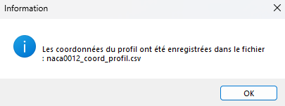


Ce fichier est automatiquement sauvegardé dans le dossier :

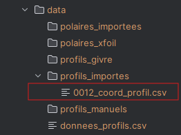     

Il contient les coordonnées (x, y) du contour du profil NACA0012, récupérées depuis AirfoilTools.

> Le fichier pourra être réutilisé plus tard pour la simulation, le tracé,  la comparaison et  transformation.

### Afficher le contour du profil:

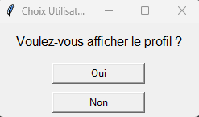

Après l’importation, le programme demande à l’utilisateur s’il souhaite **afficher le contour du profil NACA** :

```text
Voulez-vous afficher le profil ?
[Oui]   [Non]
```
Si l’utilisateur clique sur **Oui**, une fenêtre graphique s’ouvre avec la forme du profil aérodynamique tracée à partir des coordonnées enregistrées.

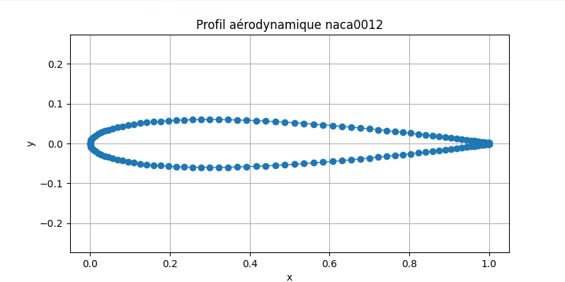

###  Récupérer les performances aérodynamiques

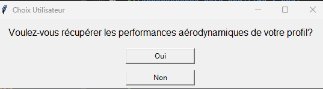

Le programme demande ensuite si l’utilisateur souhaite **récupérer les performances aérodynamiques du profil** :

```text
Voulez-vous récupérer les performances aérodynamiques de votre profil ?
[Oui]   [Non]
```  
 En cliquant sur **Oui**, le programme va automatiquement :
### Dans le cas importer
- chercher le fichier de polaire (`.txt`) correspondant au profil et au nombre de Reynolds  
- le télécharger depuis [AirfoilTools](http://airfoiltools.com)  
- le convertir en tableau `pandas.DataFrame`  
- stocker les coefficients suivants :

  - **CL** : coefficient de portance  
  - **CD** : coefficient de traînée  
  - **CM** : coefficient de moment


### Choisir le nombre de Reynolds

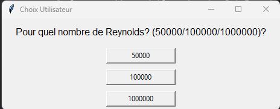

Le programme demande ensuite à l’utilisateur de **choisir le nombre de Reynolds**, parmi les valeurs proposées :  
Ce choix permet de récupérer le bon fichier **.txt** de polaire correspondant au profil et au cas de vol simulé (viscosité, vitesse, corde).

### Stockage automatique du fichier de polaire

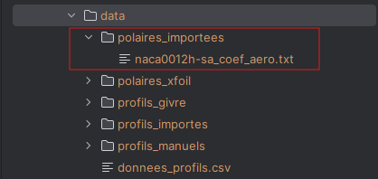

Une fois les performances aérodynamiques récupérées, le programme sauvegarde automatiquement un fichier `.txt` contenant les **données de polaire** du profil (CL, CD, CM à différents angles).

Ce fichier est enregistré dans le dossier suivant :  
Dans notre exemple :  
```text
data/polaires_importees/naca0012h-sa_coef_aero.txt

```
Afficher les courbes aérodynamiques

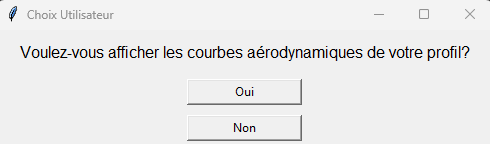   


Une fois les coefficients aérodynamiques récupérés, le programme propose à l’utilisateur d’**afficher les courbes aérodynamiques** du profil :

```text
Voulez-vous afficher les courbes aérodynamiques de votre profil ?
[Oui]   [Non]
```
###  Visualisation des courbes aérodynamiques

📈 Si l’utilisateur clique sur **Oui** à l’étape précédente, le programme affiche une **figure contenant quatre graphes** générés à partir des données de la polaire.

Les courbes tracées sont :

- **CL (portance) en fonction de l’angle d’attaque α**
- **CD (traînée) en fonction de α**
- **CM (moment) en fonction de α**

---

Chaque sous-graphe donne des informations essentielles pour analyser le comportement aérodynamique du profil, comme :

- La pente de portance  
- Le point de décrochage  
- L’évolution de la traînée  
- Le moment de tangage  


>  Ces données permettent de juger si un profil est adapté à un vol subsonique, stable, performant, etc.

---

 Le tracé est interactif et utilise la bibliothèque `matplotlib`.

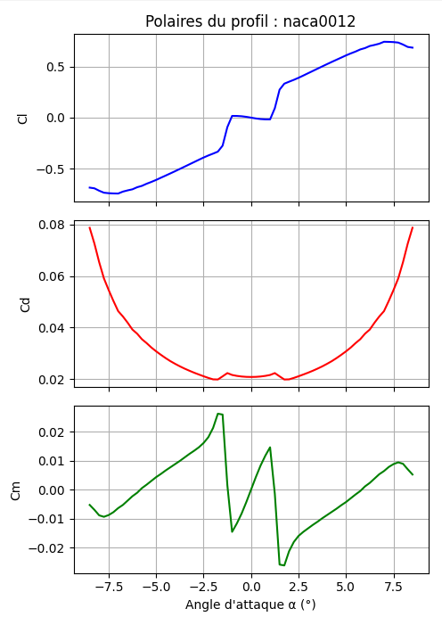  


###  Calcul de la finesse maximale

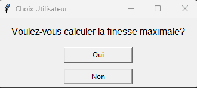  


Une fois les performances récupérées, le programme propose de **calculer la finesse maximale** du profil :

```text
Voulez-vous calculer la finesse maximale ?
[Oui]   [Non]
```
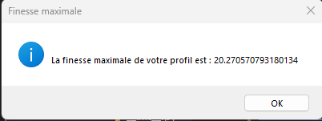


###  Simulation du profil en conditions de vol

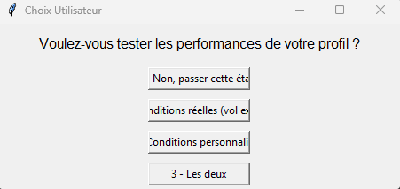  
Le programme propose ensuite de **tester les performances du profil dans des conditions de vol** :  


```text
Voulez-vous tester les performances de votre profil ?
1 - Non, passer cette étape
2 - Conditions réelles (vol existant)
3 - Conditions personnalisées
4 - Les deux
```
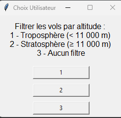  


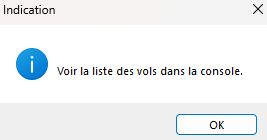  


####  Pourquoi faire cette simulation ?

L’objectif est de **voir comment le profil se comporte en situation réelle**, en tenant compte de paramètres comme :

- **Altitude**
- **Vitesse**
- **Température atmosphérique**
- **Nombre de Mach**
- **Nombre de Reynolds**

---

####  Deux possibilités s’offrent à l’utilisateur :

- **Conditions réelles** : les données sont récupérées automatiquement via l’API **OpenSky**  
  _(ex : un vol à 9700 m d’altitude, 240 m/s)_

- **Conditions personnalisées** : l’utilisateur entre lui-même ses paramètres (**altitude**, **vitesse**, **angle d’attaque**, etc.)

- **Les deux** : permet de **comparer l’effet de l’altitude ou de la vitesse** sur le même profil

>  Très utile pour observer l’impact des conditions de vol sur les performances du profil (comme la finesse ou la polaire aérodynamique).

### Simulation en conditions réelles (OpenSky)  

Lorsque l'utilisateur choisit **vol réel**, une liste de vols est générée automatiquement. On peut également filtrer par **altitude** :  
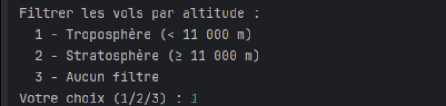  


 **Note importante** : XFoil ne fonctionne pas bien au-delà de Mach 0.7.   
> Il faut donc s’assurer de choisir un vol avec une vitesse inférieure (~120 m/s max selon l’altitude).

L’utilisateur peut :  
- **Regénérer la liste** s’il ne la trouve pas satisfaisante,  

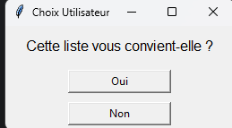   
- 
- ou **sélectionner un vol** à l’aide de son numéro.  
- 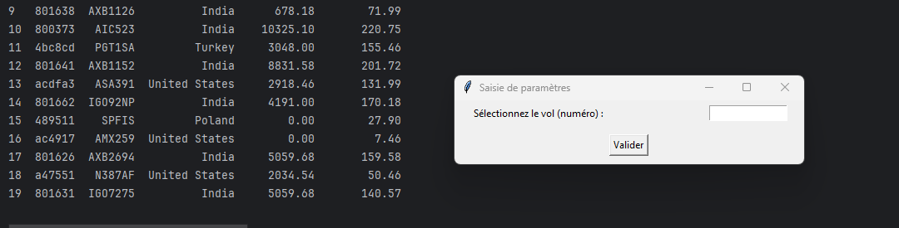
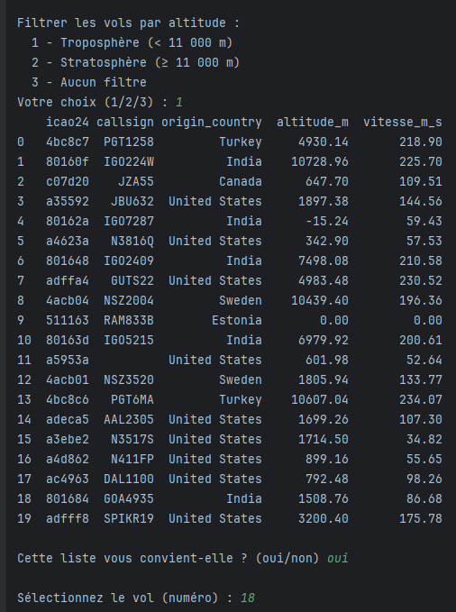
Les conditions de ce vol seront automatiquement utilisées pour simuler les performances du profil, et les résultats seront sauvegardés dans le fichier :

```bash  

data/polaires_importees/naca0012_vol_reel.txt
```  
###  Saisie des conditions personnalisées:  
Ensuite, pour le vol personnalisé, l'utilisateur est invité à saisir manuellement :


Altitude (en m)

Nombre de Mach

Angle d’attaque (en degrés)  

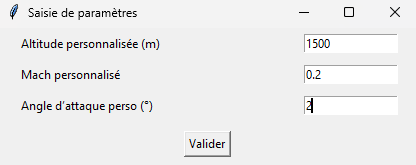  


Une simulation XFoil est alors lancée avec ces conditions. Les résultats sont sauvegardés dans :  
```bash  

data/polaires_importees/naca0012_vol_perso.txt
```  
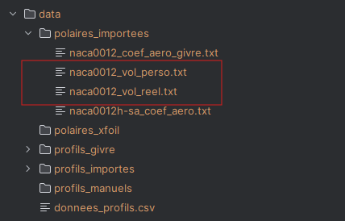  

### Comparaison graphique : superposition des résultats:  
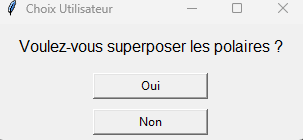  

À la fin, l'utilisateur peut choisir de superposer les polaires (graphiques CL, CD, CM) pour comparaison :


CL vs α

CD vs α

CM vs α

CL vs CD (la finesse)

Les résultats des simulations sont affichés sous forme de graphiques :


Chaque courbe représente une simulation différente :

🔵 Profil importé

🟠 Vol réel

🟢 Vol personnalisé  

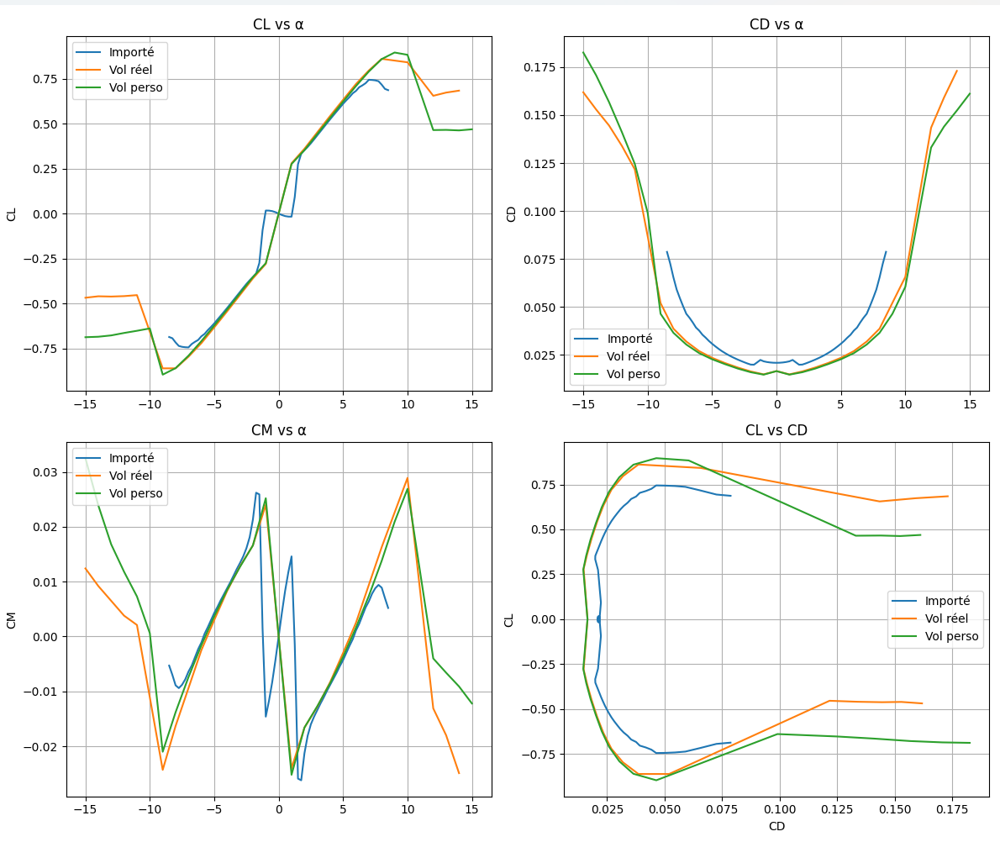    


Cette comparaison visuelle permet d’analyser l’impact des différentes conditions de vol sur le profil.
## Comparaison de contours de deux profils NACA

Le programme propose à l'utilisateur une **fonctionnalité de comparaison géométrique** entre deux profils aérodynamiques. Cette option permet de superposer les contours des deux profils pour en analyser visuellement les différences de forme.

---

###  Étapes de la comparaison  

1. **Proposition de comparaison :**    
   Une boîte de dialogue demande à l'utilisateur s’il souhaite comparer deux profils d’aile.

   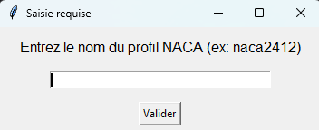   

2. **Saisie du premier profil :**  
   L’utilisateur est invité à entrer le nom du premier profil (ex : `naca0012`).   
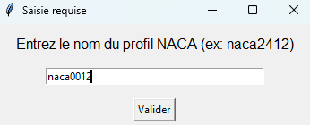  

   Une fois saisi, le programme importe automatiquement les coordonnées (x, y) depuis le site AirfoilTools.


  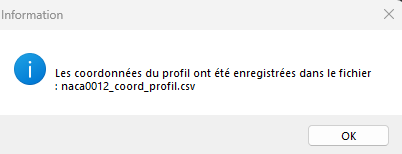  


   Le programme confirme ensuite que les coordonnées ont bien été enregistrées :


3. **Saisie du deuxième profil :**  
   L’utilisateur saisit le nom du deuxième profil (ex : `naca22112`).

  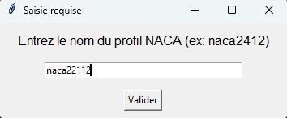  

   Le programme confirme également l’enregistrement de ce second profil :

   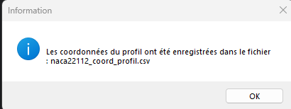

---

###  Sauvegarde des fichiers

Les coordonnées des deux profils sont automatiquement sauvegardées dans le dossier `data/profils_importes` sous deux formats :
- `.csv` : format tabulaire exploitable
- `.dat` : format utilisable par XFoil

```text
data/
└── profils_importes/
    ├── naca0012_coord_profil.csv
    ├── naca0012_coord_profil.dat
    ├── naca22112_coord_profil.csv
    └── naca22112_coord_profil.dat
```
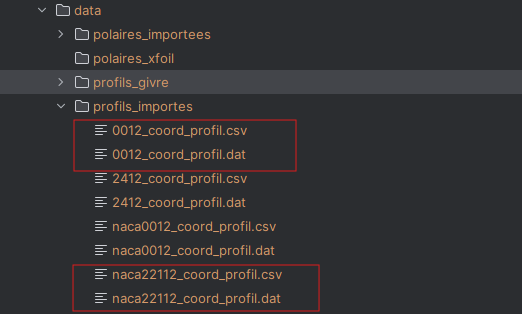  

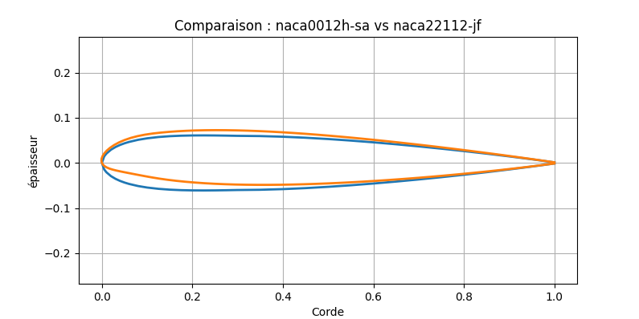  

# Simulation de givrage sur un profil NACA

##  Objectif

L’objectif est de **simuler un dépôt de givre** sur une zone spécifique d’un profil aérodynamique (ex. NACA22112), puis d’observer **l’impact du givrage sur les performances aérodynamiques** (portance, traînée, moment).

---

##  Étapes de la simulation

###  Choix de l'utilisateur  


Une boîte de dialogue s'affiche pour demander :  

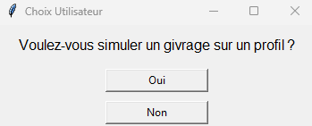  
l'utilisateur doit choisir s'il veut simuler le profile qu'il a importer ou bien de la base (data)  

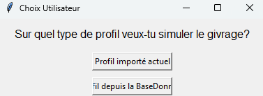

 Saisie des paramètres de givrage

Si l'utilisateur clique sur **Oui**, plusieurs fenêtres s’affichent successivement :

####  Épaisseur du givre

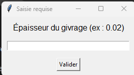  

L’utilisateur entre une valeur (ex. `0.01`) correspondant à l’**épaisseur ajoutée** au profil.  

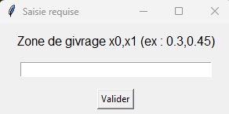  

Cela permet de définir la portion du profil impactée par le givre (ex. entre 45% et 50% de la corde).   


### Paramètres de vol pour simulation XFoil:  

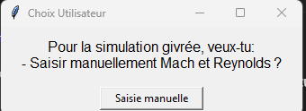  

L'utilisateur doit alors entrer :  


####  Nombre de Reynolds  
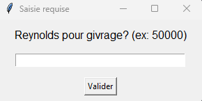

####  Nombre de Mach  
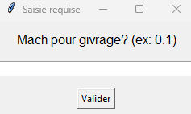


## ️ Génération des fichiers – Simulation de givrage


une fois que l'utilisateur entre les **paramètres du givrage**, le programme applique une transformation géométrique sur le profil choisi :

- `épaisseur` : intensité du givrage à appliquer (exprimée en fraction de la corde, ex. `0.02`)
- `zone` : intervalle (ex. `(0.2, 0.8)`) représentant la portion du profil affectée par le givrage, exprimée aussi en fraction de la corde.

---

###  Étapes automatiques :

1.  Le fichier `.csv` original du profil (ex. `naca0012_coord_profil.csv`) est chargé.
2.  Le programme applique une **modification des coordonnées `(x, y)`** dans la zone spécifiée afin de simuler un **défaut de type givrage** (excroissance localisée).
3.  Deux nouveaux fichiers sont générés :
   - `nacaXXXX-suffixe_coord_givre.csv` : coordonnées modifiées avec givrage (pour visualisation)
   - `nacaXXXX-suffixe_coord_givre.dat` : format `.dat` pour XFoil
4.  XFoil est lancé sur ce nouveau profil modifié.
5.  Les résultats sont enregistrés dans les répertoires suivants :

```bash

data/
├── profils_givre/              # coordonnées du profil avec givrage
│   ├── nacaXXXX-jf_coord_givre.csv
│   └── nacaXXXX-jf_coord_givre.dat
├── polaires_importees/        # polaire générée avec le profil givré
│   └── nacaXXXX_coef_aero_givre.txt
```
---
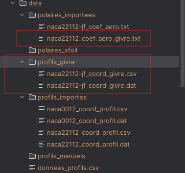


##  Résultats graphiques
###  Comparaison des performances aérodynamiques

Les résultats sont comparés entre le profil **normal** et le profil **givré** :

- CL vs α
- CD vs α
- CM vs α
- CL vs CD

---
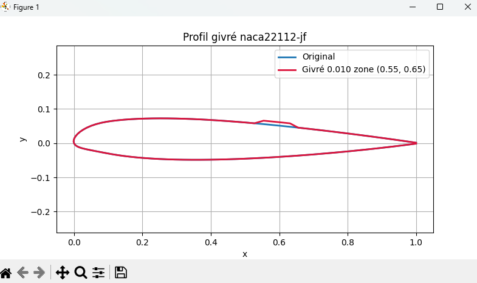
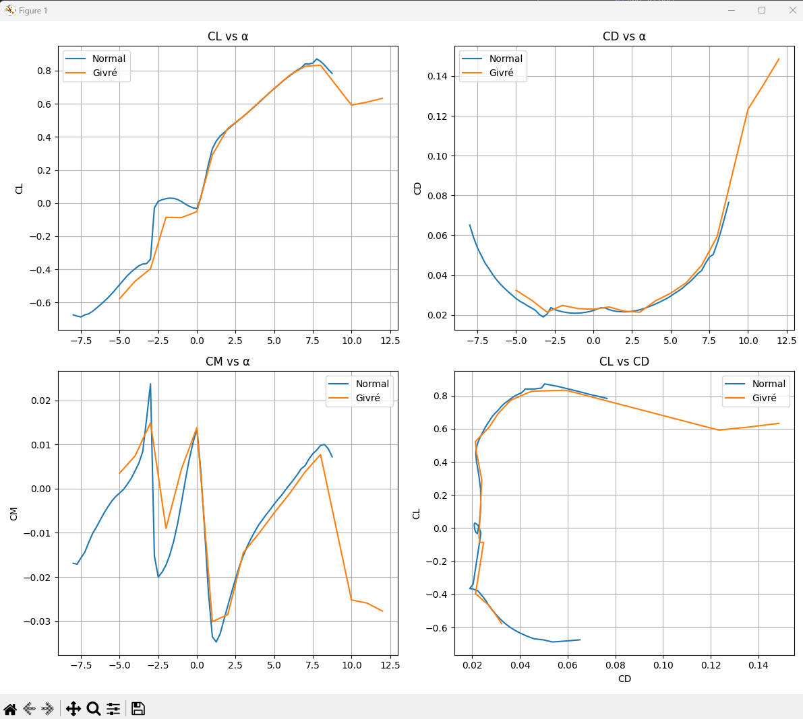

##  Observations

- Le givrage **réduit la portance maximale**
- Il **augmente significativement la traînée**
- L’efficacité globale est diminuée (courbe CL/CD moins tendue)
- Le moment de tangage est perturbé, ce qui pourrait affecter la stabilité de l’aéronef

---

## Démenstration dans le cas ge générer ou de labse :  
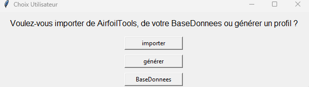  

##  Mode  : Générer un profil NACA

Lorsque l’utilisateur choisit de **générer manuellement un profil NACA**, une suite d'étapes lui permet de créer un profil, de visualiser son contour, puis d'en calculer les performances aérodynamiques à l’aide de XFoil.

---

###  Saisie du nom du profil

L’utilisateur est invité à saisir un nom de profil (par exemple : `naca3312`) :  
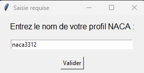  

### ️  Définition des paramètres géométriques

L’utilisateur renseigne ensuite les **paramètres géométriques** du profil :

| Paramètre | Description |
|-----------|-------------|
| **Cambrure** (entre 0 et 1) | Hauteur maximale du bombement du profil. Influence la portance. |
| **Position de la cambrure maximale** (entre 0 et 1) | Emplacement (en pourcentage de la corde) où se trouve la cambrure maximale. |
| **Épaisseur maximale** (entre 0 et 1) | Épaisseur maximale du profil, exprimée en proportion de la corde. |
| **Longueur de corde** | Longueur totale du profil (en mètres ou toute unité cohérente). |  

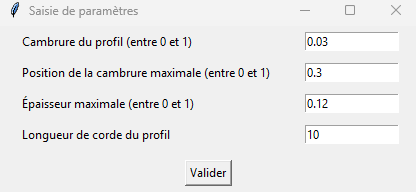  


###   Affichage du profil généré

Une fois les paramètres validés, l’utilisateur peut choisir d'afficher le contour du profil :

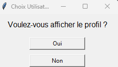  
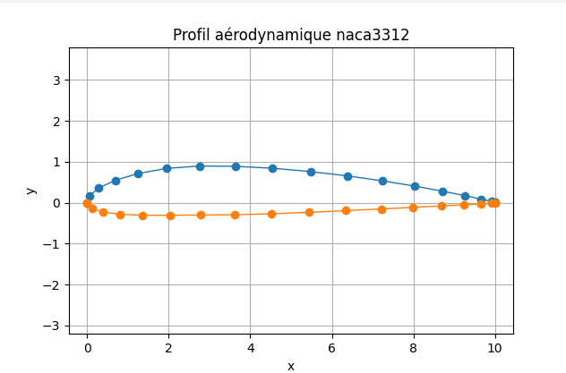  


---
###  Calcul des performances aérodynamiques

Une fois les paramètres validés, l’utilisateur peut choisir d'afficher le contour du profil :  

- Le **nombre de Mach** ( limité à **0.7 max** pour rester en domaine subsonique).
- Le **nombre de Reynolds** (lié à la vitesse, la densité de l’air et la corde).  

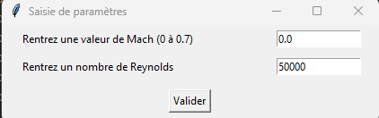  

---

###   Génération et affichage des polaires

Une fois la simulation lancée, XFoil génère automatiquement les polaires du profil (`Cl`, `Cd`, `Cm` en fonction de l’angle d’attaque α) :

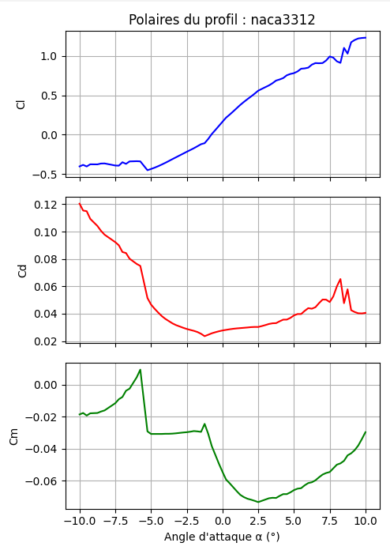  


---

### Sauvegarde automatique des fichiers

Tous les fichiers générés sont enregistrés automatiquement dans les répertoires suivants :

- `data/profils_manuels/` : pour les coordonnées du profil (`.csv` et `.dat`)
- `data/polaires_xfoil/` : pour le fichier de coefficients aérodynamiques (`.txt`)

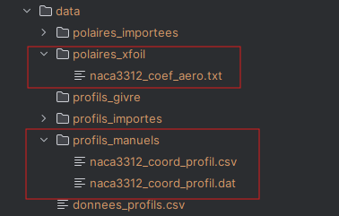  


---

 Ce processus permet ensuite à l’utilisateur d’utiliser ce profil dans toutes les simulations proposées par le programme, y compris la simulation de givrage, de vol réel ou de comparaison.

## Simulation de givrage depuis un profil générer :  
Lorsqu’un profil a été généré , il est enregistré dans la base de données locale (data/). Pour simuler le givrage, on le récupère directement depuis la base.

```bash  

data/profils_manuels
```  

### Étapes de la simulation givrée :  
Choix du type de profil :  

- L'utilisateur choisit "Profil depuis la base" pour simuler un givrage sur un profil déjà enregistré.  

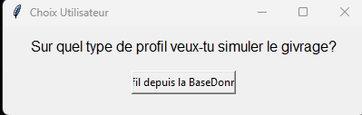  

- Le nom du profil (ex. naca3312) doit être exactement celui utilisé lors de la génération.  
  

- Épaisseur du givre :

Épaisseur (en mètre) à ajouter localement sur le profil. Ex : 0.007

  

Zone de givrage :

Définir la zone sur l’abscisse pour appliquer le givrage (ex: 0.5,0.55).  
  

Paramètres de simulation :

L’utilisateur choisit ensuite comment fournir les paramètres aérodynamiques pour la simulation.   
### Reynolds pour givrage :  

    
### Mach pour givrage : 


Ensuite en a le contour afficher des deux profils :  


### Résultat graphique  :
  

Le profil original est comparé au profil modifié par givrage.  

  


##  Mode  : BaseDonnees
Affiche la liste des profils déjà existants dans la base de données (profils .csv et .dat).  

    

L’utilisateur entre le nom exact du profil souhaité (ex. : naca3312).  


Le programme charge directement ce profil pour affichage ou simulation.  

