#  Exemple documenté d’utilisation du programme

Ce document montre comment un utilisateur externe peut :

- Installer le programme
- Lancer le programme (`main.py`)
- Utiliser ses fonctionnalités principales

---


## 📦 Installation du programme
```
pip install projet_sessionE2025
```

Vous pouvez également le cloner en faisant:

```
git clone https://github.com/LINA-SEGL/projet_sessionE2025.git
cd projet_sessionE2025
pip install -e
```

##  Exemple d'utilisation avec `main.py`

Pour tester rapidement le programme après installation :
```
Run Main.py
```

 Déroulement et fonctionnalités testées

L’utilisateur sera guidé par des menus interactifs.

### 🔹 Exemple de scénario dans le cas d'import  :

1. Importer un profil depuis **AirfoilTools** (ex: `naca2412`)
2. Afficher le **contour du profil**
3. Générer les **courbes aérodynamiques** (CL, CD, CM) via **AirfoilTools-XFoil**
4. Simuler un **vol réel** (OpenSky) ou **personnalisé**
5. Afficher les **courbes correspondantes**
6. Calculer la **finesse maximale**
7. Simuler un **givrage** (zone personnalisée, Mach, Reynolds)
8. Afficher la **comparaison des polaires normales/givrées**

---

##  Remarques

- Le programme fonctionne en **ligne de commande**, avec **affichage graphique** via `matplotlib`.
- L’utilisateur **n’a pas besoin de modifier le code** : tout est guidé pas à pas.

---

##  Résultat attendu

L'utilisateur est capable de :

-  Importer un profil  
-  Obtenir ses performances aérodynamiques  
-  Les visualiser et les comparer  
-  Tester des conditions réelles de vol ou bien personnelles 
-  Appliquer une simulation de givrage à fin de voir son influence sur les performmance 


##  Simulation étape par étape

### Étape 1 : Choix du mode d’obtention du profil
Dès que l’on lance le programme 

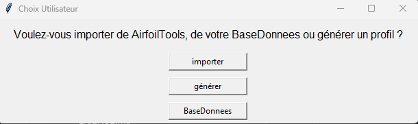

Une fenêtre s’ouvre pour demander **comment obtenir un profil NACA** :

- **Importer** → depuis le site [AirfoilTools](http://airfoiltools.com)  
- **Générer** → créer un profil NACA à partir des paramètres manuels  
- **BaseDonnees** → charger un profil déjà enregistré dans la base locale  

>  Comme il s'agit de la première utilisation, la base de données est encore vide.  
> Il faut donc **soit importer un profil, soit en générer un nouveau**.

### Étape 2 : Importer un profil NACA de Airfoil

Si l’on choisit **Importer**, une nouvelle fenêtre apparaît.  
L’utilisateur est invité à **entrer le nom du profil NACA à importer**.

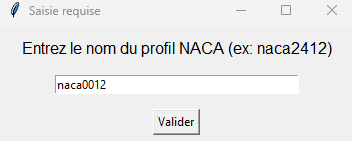

 Il suffit de saisir :
- soit les **4 chiffres** du profil NACA classique (`naca2412`, `naca0012`, etc.)
- soit **5 ou 6 chiffres** pour les profils plus complexes (`naca23012`, `naca633418`, etc.)

 Le profil doit exister sur le site [AirfoilTools](http://airfoiltools.com) pour que l’import fonctionne.

Dans notre exemple, nous saisissons :
```text
naca0012
```
### Confirmation de l’import et enregistrement du profil
une fois le profil importé, le programme affiche une **fenêtre d’information** confirmant que :

> Les coordonnées du profil ont été enregistrées dans le fichier : `0012_coord_profil.csv`  
> 
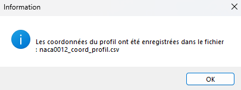


Ce fichier est automatiquement sauvegardé dans le dossier :

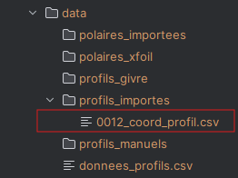     

Il contient les coordonnées (x, y) du contour du profil NACA0012, récupérées depuis AirfoilTools.

> Le fichier pourra être réutilisé plus tard pour la simulation, le tracé,  la comparaison et  transformation.

### Afficher le contour du profil:

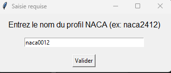

Après l’importation, le programme demande à l’utilisateur s’il souhaite **afficher le contour du profil NACA** :

```text
Voulez-vous afficher le profil ?
[Oui]   [Non]
```
Si l’utilisateur clique sur **Oui**, une fenêtre graphique s’ouvre avec la forme du profil aérodynamique tracée à partir des coordonnées enregistrées.

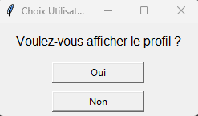

### Étape 3 : Récupérer les performances aérodynamiques

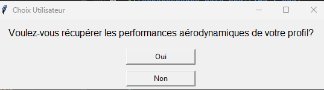

Le programme demande ensuite si l’utilisateur souhaite **récupérer les performances aérodynamiques du profil** :

```text
Voulez-vous récupérer les performances aérodynamiques de votre profil ?
[Oui]   [Non]
```  
 En cliquant sur **Oui**, le programme va automatiquement :
### Dans le cas importer
- chercher le fichier de polaire (`.txt`) correspondant au profil et au nombre de Reynolds  
- le télécharger depuis [AirfoilTools](http://airfoiltools.com)  
- le convertir en tableau `pandas.DataFrame`  
- stocker les coefficients suivants :

  - **CL** : coefficient de portance  
  - **CD** : coefficient de traînée  
  - **CM** : coefficient de moment


### Choisir le nombre de Reynolds

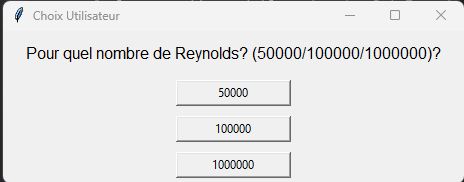

Le programme demande ensuite à l’utilisateur de **choisir le nombre de Reynolds**, parmi les valeurs proposées :  
Ce choix permet de récupérer le bon fichier **.txt** de polaire correspondant au profil et au cas de vol simulé (viscosité, vitesse, corde).

### Stockage automatique du fichier de polaire

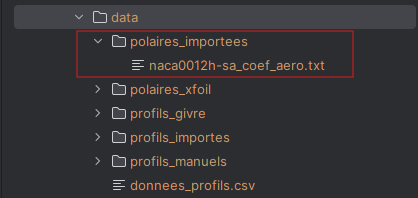

Une fois les performances aérodynamiques récupérées, le programme sauvegarde automatiquement un fichier `.txt` contenant les **données de polaire** du profil (CL, CD, CM à différents angles).

Ce fichier est enregistré dans le dossier suivant :  
Dans notre exemple :  
```text
data/polaires_importees/naca0012h-sa_coef_aero.txt

```
Afficher les courbes aérodynamiques

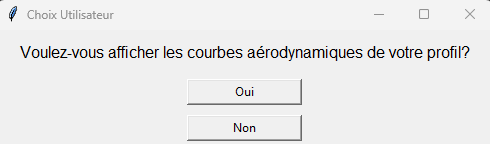   


Une fois les coefficients aérodynamiques récupérés, le programme propose à l’utilisateur d’**afficher les courbes aérodynamiques** du profil :

```text
Voulez-vous afficher les courbes aérodynamiques de votre profil ?
[Oui]   [Non]
```
### Étape 5 : Visualisation des courbes aérodynamiques

📈 Si l’utilisateur clique sur **Oui** à l’étape précédente, le programme affiche une **figure contenant quatre graphes** générés à partir des données de la polaire.

Les courbes tracées sont :

- **CL (portance) en fonction de l’angle d’attaque α**
- **CD (traînée) en fonction de α**
- **CM (moment) en fonction de α**

---

Chaque sous-graphe donne des informations essentielles pour analyser le comportement aérodynamique du profil, comme :

- La pente de portance  
- Le point de décrochage  
- L’évolution de la traînée  
- Le moment de tangage  


>  Ces données permettent de juger si un profil est adapté à un vol subsonique, stable, performant, etc.

---

 Le tracé est interactif et utilise la bibliothèque `matplotlib`.

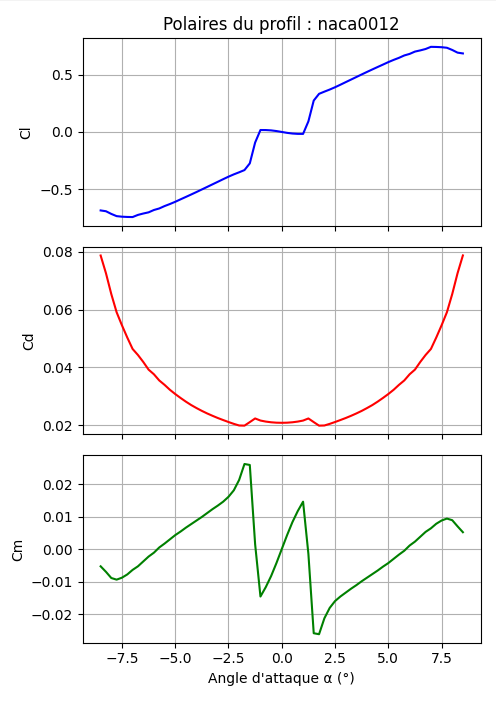  


### Étape 10 : Calcul de la finesse maximale

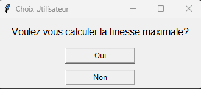  


Une fois les performances récupérées, le programme propose de **calculer la finesse maximale** du profil :

```text
Voulez-vous calculer la finesse maximale ?
[Oui]   [Non]
```
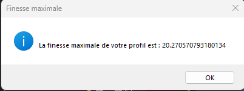


### Étape 6 : Simulation du profil en conditions de vol

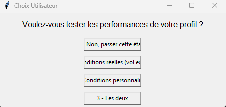  
Le programme propose ensuite de **tester les performances du profil dans des conditions de vol** :  


```text
Voulez-vous tester les performances de votre profil ?
1 - Non, passer cette étape
2 - Conditions réelles (vol existant)
3 - Conditions personnalisées
4 - Les deux
```
####  Pourquoi faire cette simulation ?

L’objectif est de **voir comment le profil se comporte en situation réelle**, en tenant compte de paramètres comme :

- **Altitude**
- **Vitesse**
- **Température atmosphérique**
- **Nombre de Mach**
- **Nombre de Reynolds**

---

####  Deux possibilités s’offrent à l’utilisateur :

- **Conditions réelles** : les données sont récupérées automatiquement via l’API **OpenSky**  
  _(ex : un vol à 9700 m d’altitude, 240 m/s)_

- **Conditions personnalisées** : l’utilisateur entre lui-même ses paramètres (**altitude**, **vitesse**, **angle d’attaque**, etc.)

- **Les deux** : permet de **comparer l’effet de l’altitude ou de la vitesse** sur le même profil

>  Très utile pour observer l’impact des conditions de vol sur les performances du profil (comme la finesse ou la polaire aérodynamique).


## Comparaison de contours de deux profils NACA

Le programme propose à l'utilisateur une **fonctionnalité de comparaison géométrique** entre deux profils aérodynamiques. Cette option permet de superposer les contours des deux profils pour en analyser visuellement les différences de forme.

---

###  Étapes de la comparaison  

1. **Proposition de comparaison :**    
   Une boîte de dialogue demande à l'utilisateur s’il souhaite comparer deux profils d’aile.

   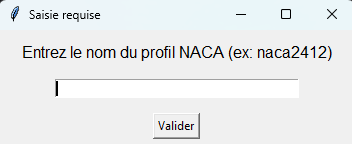   

2. **Saisie du premier profil :**  
   L’utilisateur est invité à entrer le nom du premier profil (ex : `naca0012`).   
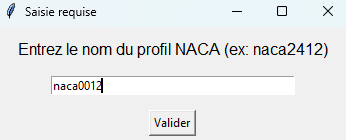  

   Une fois saisi, le programme importe automatiquement les coordonnées (x, y) depuis le site AirfoilTools.


  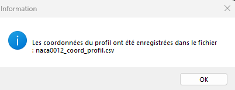  


   Le programme confirme ensuite que les coordonnées ont bien été enregistrées :


3. **Saisie du deuxième profil :**  
   L’utilisateur saisit le nom du deuxième profil (ex : `naca22112`).

  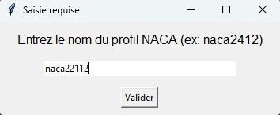  

   Le programme confirme également l’enregistrement de ce second profil :

   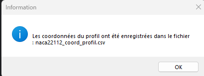

---

###  Sauvegarde des fichiers

Les coordonnées des deux profils sont automatiquement sauvegardées dans le dossier `data/profils_importes` sous deux formats :
- `.csv` : format tabulaire exploitable
- `.dat` : format utilisable par XFoil

```text
data/
└── profils_importes/
    ├── naca0012_coord_profil.csv
    ├── naca0012_coord_profil.dat
    ├── naca22112_coord_profil.csv
    └── naca22112_coord_profil.dat
```
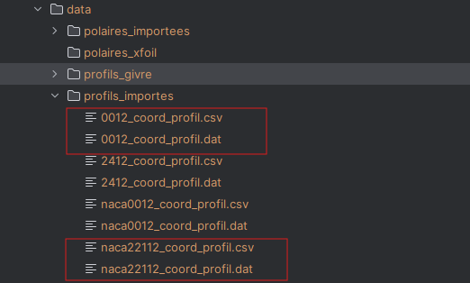  

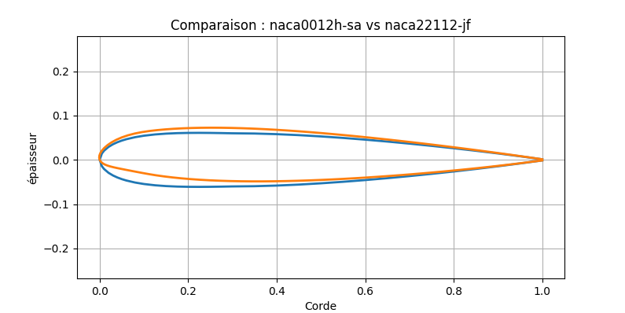  

# Simulation de givrage sur un profil NACA

##  Objectif

L’objectif est de **simuler un dépôt de givre** sur une zone spécifique d’un profil aérodynamique (ex. NACA22112), puis d’observer **l’impact du givrage sur les performances aérodynamiques** (portance, traînée, moment).

---

##  Étapes de la simulation

###  Choix de l'utilisateur  


Une boîte de dialogue s'affiche pour demander :  

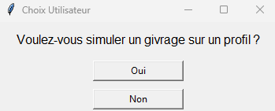

 Saisie des paramètres de givrage

Si l'utilisateur clique sur **Oui**, plusieurs fenêtres s’affichent successivement :

####  Épaisseur du givre

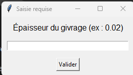  

L’utilisateur entre une valeur (ex. `0.01`) correspondant à l’**épaisseur ajoutée** au profil.  

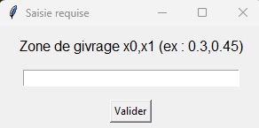  

Cela permet de définir la portion du profil impactée par le givre (ex. entre 45% et 50% de la corde).   


### Paramètres de vol pour simulation XFoil:  

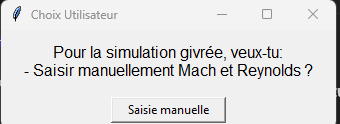  

L'utilisateur doit alors entrer :  


#### ➤ Nombre de Reynolds
#### ➤ Nombre de Mach

## ️ Génération des fichiers

Une fois les entrées validées, le programme :

1. **Crée un nouveau fichier .dat** contenant le contour du profil modifié avec le givre.
2. **Crée un fichier .csv** avec les mêmes coordonnées pour consultation.
3. **Exécute XFoil** avec ces nouveaux fichiers.
4. **Sauvegarde les résultats dans** :
   - `data/profils_givre/` : les coordonnées du profil givré.
   - `data/polaires_importees/` : les coefficients aérodynamiques du profil givré.

---
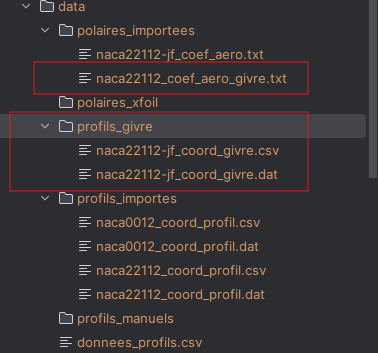


##  Résultats graphiques
###  Comparaison des performances aérodynamiques

Les résultats sont comparés entre le profil **normal** et le profil **givré** :

- CL vs α
- CD vs α
- CM vs α
- CL vs CD

---
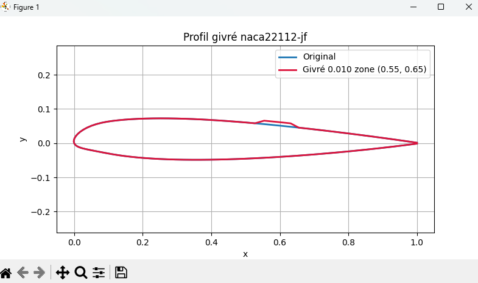
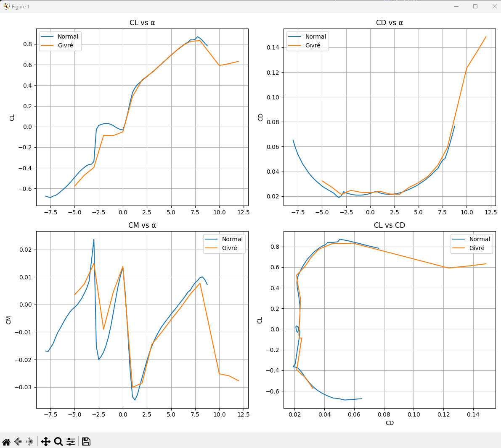

##  Observations

- Le givrage **réduit la portance maximale**
- Il **augmente significativement la traînée**
- L’efficacité globale est diminuée (courbe CL/CD moins tendue)
- Le moment de tangage est perturbé, ce qui pourrait affecter la stabilité de l’aéronef

---