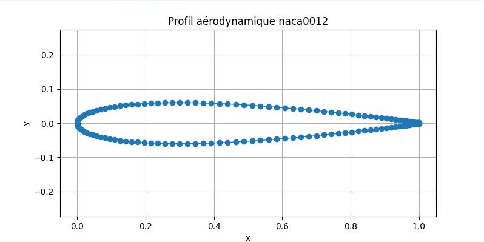

#  Exemple documenté d’utilisation du programme

Ce document montre comment un utilisateur externe peut :

- Installer le programme
- Lancer le programme (`main.py`)
- Utiliser ses fonctionnalités principales

---


## 📦 Installation du programme
```
pip install projet_sessionE2025
```

Vous pouvez également le cloner en faisant:

```
git clone https://github.com/LINA-SEGL/projet_sessionE2025.git
cd projet_sessionE2025
pip install -e
```

##  Exemple d'utilisation avec `main.py`

Pour tester rapidement le programme après installation :
```
Run Main.py
```

 Déroulement et fonctionnalités testées

L’utilisateur sera guidé par des menus interactifs.

### 🔹 Exemple de scénario dans le cas d'import  :

1. Importer un profil depuis **AirfoilTools** (ex: `naca2412`)
2. Afficher le **contour du profil**
3. Générer les **courbes aérodynamiques** (CL, CD, CM) via **AirfoilTools-XFoil**
4. Simuler un **vol réel** (OpenSky) ou **personnalisé**
5. Afficher les **courbes correspondantes**
6. Calculer la **finesse maximale**
7. Simuler un **givrage** (zone personnalisée, Mach, Reynolds)
8. Afficher la **comparaison des polaires normales/givrées**

---

##  Remarques

- Le programme fonctionne en **ligne de commande**, avec **affichage graphique** via `matplotlib`.
- L’utilisateur **n’a pas besoin de modifier le code** : tout est guidé pas à pas.

---

##  Résultat attendu

L'utilisateur est capable de :

-  Importer un profil  
-  Obtenir ses performances aérodynamiques  
-  Les visualiser et les comparer  
-  Tester des conditions réelles de vol ou bien personnelles 
-  Appliquer une simulation de givrage à fin de voir son influence sur les performmance 


##  Simulation étape par étape

### Étape 1 : Choix du mode d’obtention du profil
Dès que l’on lance le programme 

  

Une fenêtre s’ouvre pour demander **comment obtenir un profil NACA** :

- **Importer** → depuis le site [AirfoilTools](http://airfoiltools.com)  
- **Générer** → créer un profil NACA à partir des paramètres manuels  
- **BaseDonnees** → charger un profil déjà enregistré dans la base locale  

>  Comme il s'agit de la première utilisation, la base de données est encore vide.  
> Il faut donc **soit importer un profil, soit en générer un nouveau**.

### Étape 2 : Importer un profil NACA de Airfoil

Si l’on choisit **Importer**, une nouvelle fenêtre apparaît.  
L’utilisateur est invité à **entrer le nom du profil NACA à importer**.


 Il suffit de saisir :
- soit les **4 chiffres** du profil NACA classique (`naca2412`, `naca0012`, etc.)
- soit **5 ou 6 chiffres** pour les profils plus complexes (`naca23012`, `naca633418`, etc.)

 Le profil doit exister sur le site [AirfoilTools](http://airfoiltools.com) pour que l’import fonctionne.

Dans notre exemple, nous saisissons :
```text
naca0012
```
### Confirmation de l’import et enregistrement du profil
une fois le profil importé, le programme affiche une **fenêtre d’information** confirmant que :

> Les coordonnées du profil ont été enregistrées dans le fichier : `0012_coord_profil.csv`
> 


Ce fichier est automatiquement sauvegardé dans le dossier :


Il contient les coordonnées (x, y) du contour du profil NACA0012, récupérées depuis AirfoilTools.

> Le fichier pourra être réutilisé plus tard pour la simulation, le tracé,  la comparaison et  transformation.

### Afficher le contour du profil:



Après l’importation, le programme demande à l’utilisateur s’il souhaite **afficher le contour du profil NACA** :

```text
Voulez-vous afficher le profil ?
[Oui]   [Non]
```
Si l’utilisateur clique sur **Oui**, une fenêtre graphique s’ouvre avec la forme du profil aérodynamique tracée à partir des coordonnées enregistrées.

